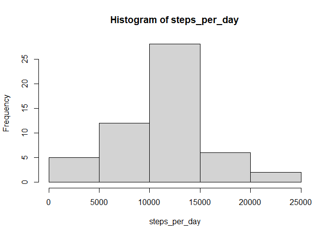
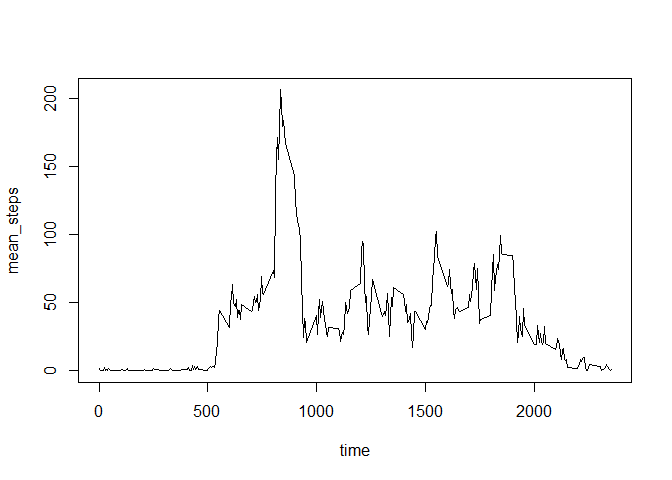
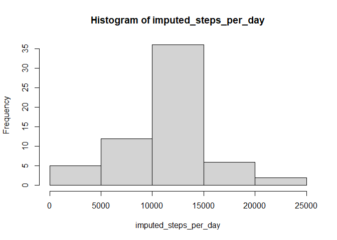
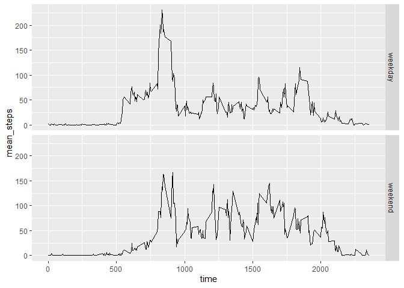

All of the R code needed to reproduce the results (numbers, plots, etc.) in the report

### Loading and preprocessing the data

First, we read the data.


```r
activity <- read.csv("activity.csv")
```

Next, we combine the date and interval columns into a single datetime column and delete the date and interval columns.

```r
library(dplyr)
activity <- 
  activity %>%
  mutate(datetime=strptime(paste(date,sprintf("%04d",interval)),"%Y-%m-%d %H%M")) %>%
  select(steps,datetime)
```

### What is mean total number of steps taken per day?

First we calculate the total number of steps taken per day and plot a histogram to visualise.

```r
steps_per_day <- activity %>% group_by(format(datetime,"%Y%m%d")) %>% summarise(daily_steps=sum(steps))
steps_per_day <- steps_per_day$daily_steps

hist(steps_per_day)
```

<!-- -->

Next we calculate the mean and median number of steps taken per day.

```r
print(paste("Mean total number of steps taken per day: ", mean(steps_per_day,na.rm=TRUE)))
```

```
## [1] "Mean total number of steps taken per day:  10766.1886792453"
```

```r
print(paste("Median total number of steps taken per day: ", median(steps_per_day,na.rm=TRUE)))
```

```
## [1] "Median total number of steps taken per day:  10765"
```

### What is the average daily activity pattern?

To visualise the daily activity pattern, we plot a time series for the mean number of steps for each time interval accross all days.

```r
daily_pattern <- activity %>% group_by(format(datetime,"%H%M")) %>% summarise(mean_steps=mean(steps,na.rm=TRUE))
names(daily_pattern)<-c("time","mean_steps")
with(daily_pattern,plot(time,mean_steps,type="l"))
```

<!-- -->


```r
print(paste("Time interval with highest number of steps: ", daily_pattern$time[daily_pattern$mean_steps==max(daily_pattern$mean_steps)]))
```

```
## [1] "Time interval with highest number of steps:  0835"
```

### Imputing missing values

First we check the number of missing values:

```r
print(paste("Number of missing values: ", sum(is.na(activity$steps))))
```

```
## [1] "Number of missing values:  2304"
```

We impute the missing values with the mean for the 5-minute time interval, rounded to the nearest integer:

```r
imputed_activity <- activity
imputed_activity$steps <- round(daily_pattern$mean_steps)
imputed_activity$steps[!is.na(activity$steps)]<-activity$steps[!is.na(activity$steps)]
```

After imputing, we revisit the total number of steps per day:

```r
imputed_steps_per_day <- imputed_activity %>% group_by(format(datetime,"%Y%m%d")) %>% summarise(daily_steps=sum(steps))
imputed_steps_per_day <- imputed_steps_per_day$daily_steps

hist(imputed_steps_per_day)
```

<!-- -->

```r
print(paste("Mean total number of steps taken per day: ", mean(imputed_steps_per_day,na.rm=TRUE)))
```

```
## [1] "Mean total number of steps taken per day:  10765.6393442623"
```

```r
print(paste("Median total number of steps taken per day: ", median(imputed_steps_per_day,na.rm=TRUE)))
```

```
## [1] "Median total number of steps taken per day:  10762"
```
Comparing with the earlier calculations, we see that the imputing of missing values have decrease the mean and median total number of steps per day.

### Are there differences in activity patterns between weekdays and weekends?

First we create a new factor variable in the dataset indicating whether a given date is a weekday or weekend day.

```r
imputed_activity$day <- "weekday"
imputed_activity$day[weekdays(imputed_activity$datetime) %in% c("Saturday","Sunday")] <- "weekend"
imputed_activity$day <- as.factor(imputed_activity$day)
```

To observe visually if there are differences in activity patterns, we make a panel plot to compare:

```r
library(ggplot2)

day_pattern <- imputed_activity %>% group_by(day, format(datetime,"%H%M")) %>% summarise(mean_steps=mean(steps))
names(day_pattern)<-c("day","time","mean_steps")
day_pattern$time <- as.numeric(day_pattern$time)
qplot(time,mean_steps,data=day_pattern, facets=day~.,geom="line")
```

<!-- -->

